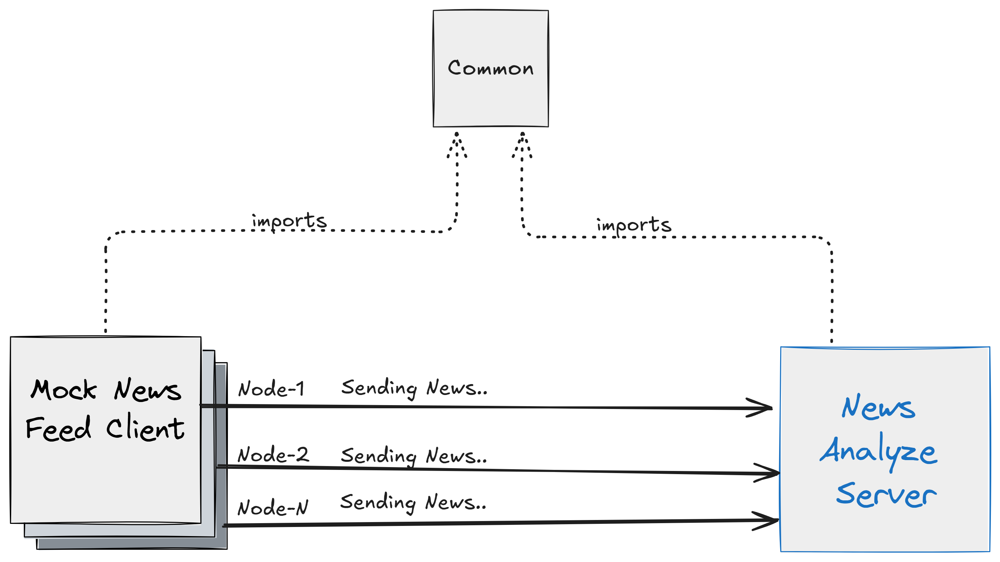

# Mock News Analyzer

* [Mock News Analyzer](#mock-news-analyzer)
    * [Overview](#overview)
    * [Architecture and Components](#architecture-and-components)
        * [**Mock News Feed (Client)**](#mock-news-feed-client)
        * [**News Analyzer (Server)**](#news-analyzer-server)
        * [**Common Module**](#common-module)
    * [Tech Stack](#tech-stack)
    * [Prerequisites](#prerequisites)
        * [1. OS Compatibility](#1-os-compatibility)
        * [2. Required Tools and Dependencies](#2-required-tools-and-dependencies)
    * [How to Build and Run the Project](#how-to-build-and-run-the-project)
        * [Step 1: Configure Properties](#step-1-configure-properties)
        * [Step 2: Deployment](#step-2-deployment)
            * [Start Services](#start-services)
            * [Logs](#logs)
            * [Stop the Services](#stop-the-services)
            * [Notes](#notes)
    * [Future Improvements](#future-improvements)
    * [📖 Core Functionality Details](#-core-functionality-details)

---

## Overview

The **Mock News Analyzer** is a Java-based system designed to simulate a real-time news feed and analyze incoming news
items. It consists of two main components:

- **Mock News Feed**: Generates and sends randomized news headlines with assigned priority levels over a TCP connection.
- **News Analyzer**: Receives incoming news messages, filters relevant ones based on sentiment analysis, and
  periodically summarizes the most important news.

The project demonstrates **real-time data processing** using **TCP communication**, **multi-threading**, and
**data generation**. The system can handle multiple concurrent news feeds and provides periodic reports
on significant news trends.

---

## Architecture and Components

The system consists of the following core components:



### **Mock News Feed (Client)**

- **Purpose**: Generates and sends randomized news items to the News Analyzer.
- **Core Functionality**:
    - Generates random news headlines using predefined keywords.
    - Assigns priority levels to news items based on a given probability distribution.
    - Sends news items to the Server over a persistent TCP connection.
    - Supports automatic reconnection if the connection is lost.
    - Configurable message sending interval through Java properties.

### **News Analyzer (Server)**

- **Purpose**: Receives and processes news messages from the Mock News Feed clients.
- **Core Functionality**:
    - Listens for incoming client connections over TCP.
    - Manages concurrent client connections efficiently using multi-threading.
    - Stores data into efficient sorted data structure.
    - Filters incoming news based on sentiment analysis.
    - Aggregates and summarizes positive news every 10 seconds.

### **Common Module**

- **Purpose**: Provides shared utilities, functionalities, and DTOs for both services.

---

## Tech Stack

| Component                       | Technology      |
|---------------------------------|-----------------|
| Language                        | Java 8          |
| Build System                    | Maven           |
| Logging                         | SLF4J + Logback |
| Networking                      | TCP Sockets     |
| Build and Dependency Management | Maven           |
| Testing Framework               | JUnit 5         |
| Mocking Library                 | Mockito         |
| Asynchronous Testing            | Awaitility      |

---

## Prerequisites

### 1. OS Compatibility

- Windows (Tested)
- Linux, MacOS

### 2. Required Tools and Dependencies

- Java 8
- Maven

---


[//]: # (List all necessary tools and dependencies needed to run the project.)

## How to Build and Run the Project

### Step 1: Configure Properties

Set the following environment variables in the deployment script (`start.bat` or `start.sh`):

| Environment Variable                   | Description                                                                                                 | Default Value |
|----------------------------------------|-------------------------------------------------------------------------------------------------------------|---------------|
| `SERVER_PORT`                          | News Analyzer Server reserved port. Ensure it is available on your machine. Used by both server and client. | `5001`        |
| `SERVER_HOST`                          | Server host: used by the client to connect to the server.                                                   | `localhost`   |
| `SERVER_CONNECTIONS_POOL_SIZE`         | Server connections pool size. Also determines the number of deployed client instances.                      | `5`           |
| `CLIENT_MESSAGE_SCHEDULER_INTERVAL_MS` | Interval for scheduled task that sends messages to the server in the client app (in milliseconds).          | `2000`        |

### Step 2: Deployment

#### Start Services

There is a deployment script (`start.bat` for Windows, `start.sh` for Unix-based systems) to clean, build the project
using Maven, and then deploy the server and client instances.

- After script execution, you should have **one server** and **multiple clients** running.
- The script opens a terminal window for each running instance to monitor logs.
    - **Server instance window title**: `NewsAnalyzerServer` - Logs:
    - **Client instance window title**: `MockNewsClient_*` (with instance number appended).

#### Logs

Once server and clients are started you should see similar logs:

Client:

```log
02:00:29.538 [main] INFO  d.t.t.m.client.MockNewsClient - Attempting to connect to News Analyzer Server at localhost:5001
02:00:29.547 [main] INFO  d.t.t.m.client.MockNewsClient - Successfully connected to the server.
02:00:29.548 [main] INFO  d.t.t.c.s.ScheduledTaskManager - Scheduled task started (Initial delay: 0 MILLISECONDS, Period: 2000 MILLISECONDS)
02:00:29.548 [pool-1-thread-1] INFO  d.t.t.m.client.MockNewsClient - Sent news item: rise über down low success;0
02:00:31.549 [pool-1-thread-1] INFO  d.t.t.m.client.MockNewsClient - Sent news item: bad high fall down low;5
02:00:37.548 [pool-1-thread-1] INFO  d.t.t.m.client.MockNewsClient - Sent news item: down good unter;1
```

Server:

```log
02:00:28.450 [main] INFO  d.t.t.c.s.ScheduledTaskManager - Scheduled task started (Initial delay: 10 SECONDS, Period: 10 SECONDS)
02:00:28.453 [main] INFO  de.tick.ts.server.NewsAnalyzerServer - News analyzer server is starting on port 5001...
02:00:29.547 [main] INFO  de.tick.ts.server.NewsAnalyzerServer - New client connected: /127.0.0.1
02:00:29.547 [pool-2-thread-1] INFO  de.tick.ts.server.ClientHandler - Handling new client connection: /127.0.0.1
02:00:29.729 [main] INFO  de.tick.ts.server.NewsAnalyzerServer - New client connected: /127.0.0.1
02:00:30.268 [pool-2-thread-5] INFO  de.tick.ts.server.ClientHandler - Handling new client connection: /127.0.0.1
02:00:38.461 [pool-1-thread-1] INFO  d.t.t.s.task.NewsSummaryReporter - Window [2025-02-04T01:00:28.457Z - 2025-02-04T01:00:38.457Z] -> Total News: 72
02:00:38.467 [pool-1-thread-1] INFO  d.t.t.s.task.NewsSummaryReporter - Priority: 5, Headline: failure good success low
02:00:38.467 [pool-1-thread-1] INFO  d.t.t.s.task.NewsSummaryReporter - Priority: 4, Headline: good high rise low unter
02:00:38.467 [pool-1-thread-1] INFO  d.t.t.s.task.NewsSummaryReporter - Priority: 1, Headline: down über rise
```

#### Stop the Services

A shutdown script (`stop.bat`, `stop.sh`) is available to terminate all running application instances.

#### Notes

- Only the Windows batch scripts have been tested.

---

## 📖 Core Functionality Details

For an in-depth explanation of some of the **major functionalities**: 👉 *
*[View Core Functionality Documentation](./docs/core-functionality.md)**

## Future Improvements

- Improve project configurability to control the resources up to what the host machine can handle.
- Write more integration (end-to-end) tests alongside the written unit tests.
- Improve deployment strategy using Docker and Docker Compose.
- Improve logs streaming into files.
- Implement rate limiter for TCP connections.
- Improve data serialization/deserialization on transmission over the network.


